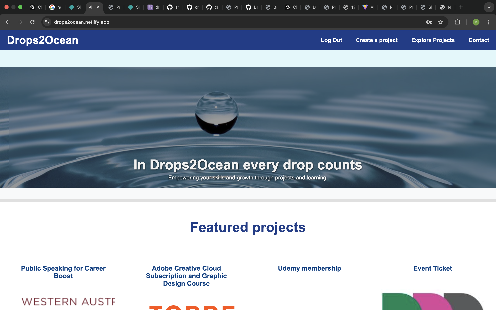
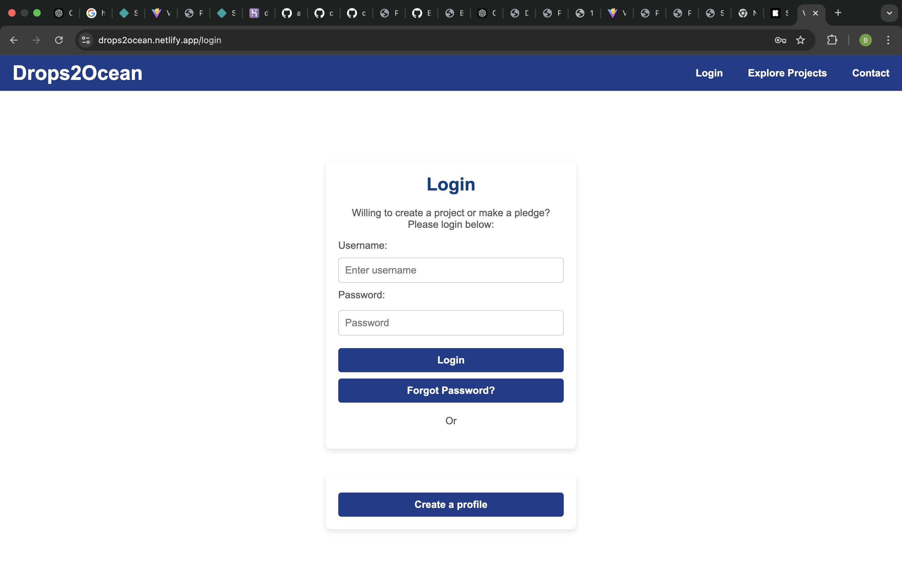
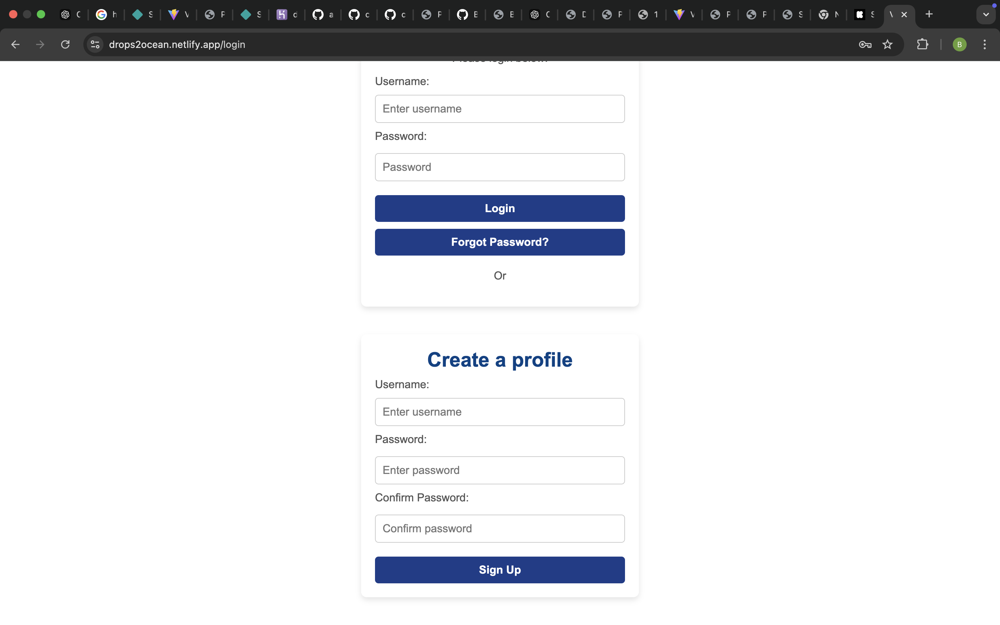
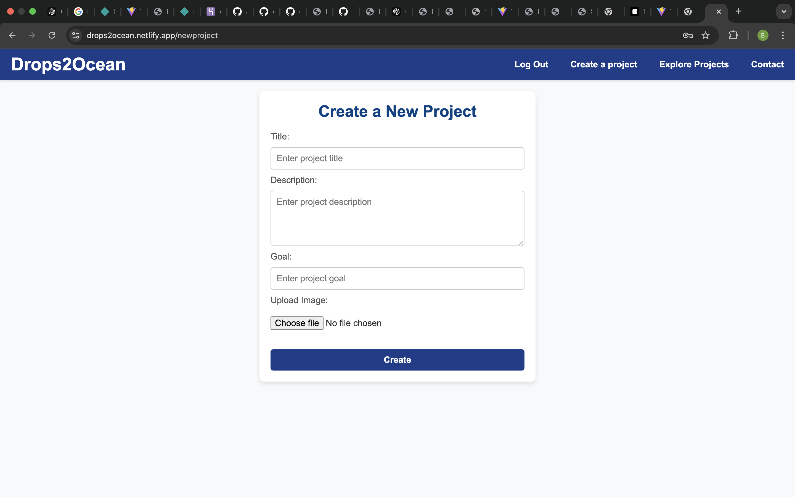
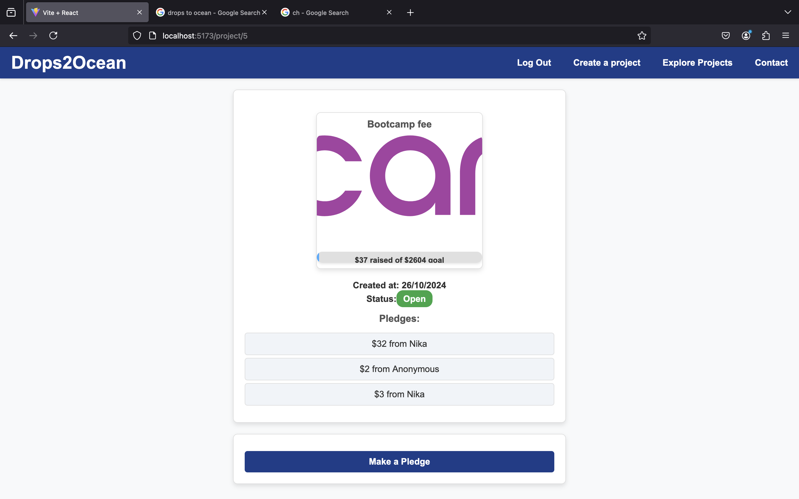
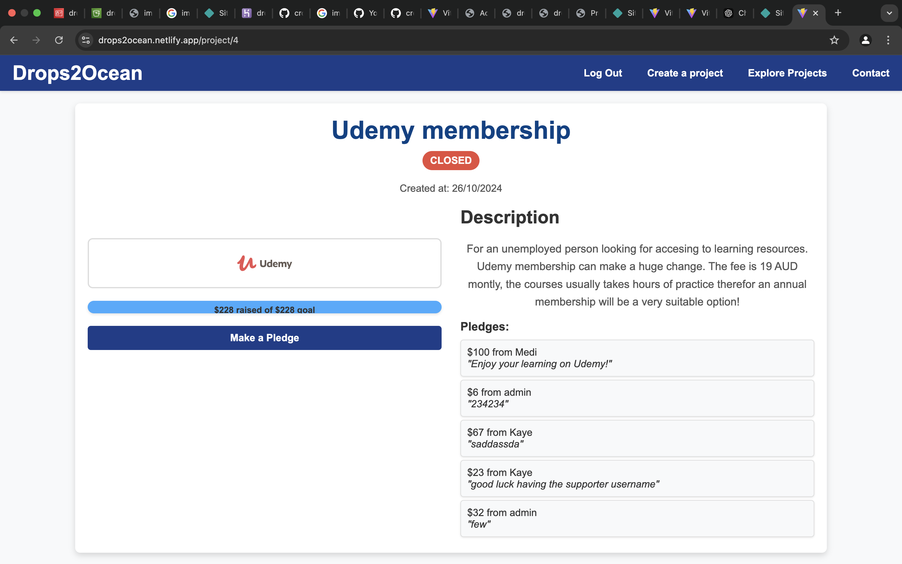

# React + Vite

## Live Demo

[Visit Drops2Ocean](https://drops2ocean.netlify.app/)

---

## **Project Name**

**Drops2Ocean**

---

## **Concept**

**Help people to be employable!**

Drops2Ocean is a platform dedicated to supporting individuals in advancing their learning, skills, and networking opportunities.Whether you’re looking to **upgrade your skillset**, prepare for the **next job interview**, or make **valuable connections**, **Drops2Ocean** is here to support you every step of the way.

---

## ** Used**

- Enable media upload (has been disabled for submissions, need some more work from backend)
- progress bar
- Error handling for making projects/pledges
- Error handling for login
- ***

## **Features**

- Crowdfunding functionality for employability goals.
- Progress tracking and status updates for campaigns.
- User pledge and commenting system.

---

## **How to Use**

1. Visit [Drops2Ocean](https://drops2ocean.netlify.app/).
2. Browse existing projects or create a new one after you signed up.
3. Make pledges to support others on their learning journey.

---

## **Future Enhancements**

- User Profiles.
- Search and Filter Features.
- Better UI experience

---

temporary UI, will work to make it better specially the project page.
Note for myself: working-develop is the branch from which project submission has been done!
About to stat working on backend-improvement with a new heroku url
